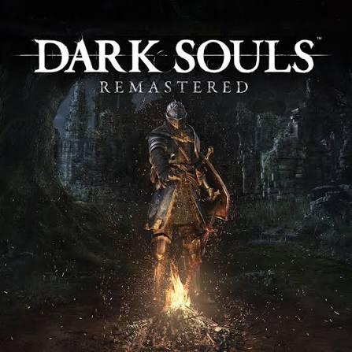

# Reino de Lordran
Practica en el lenguaje de marcado Markdown 

## Ubicación
Lordran es el reino central de la saga Dark Souls, cuna de la Era del Fuego. Se encuentra conectado por Firelink Shrine, punto de encuentro entre distintas zonas del reino. Al norte se halla Anor Londo, ciudad dorada de los dioses; al sur, los pantanos de Blighttown y la aldea de los Hollow; al este, Sen's Fortress custodia el camino hacia la ciudad divina; al oeste, el Bosque de los Gigantes Caídos oculta antiguas batallas. Lordran fue el primer reino donde ardió la Primera Llama, dando inicio a la Era del Fuego.

## Economía
Los habitantes que sobrevivieron a la maldición del Hollowing subsisten mediante el comercio de almas, objetos y armas encontradas entre las ruinas. Los mercaderes como Griggs de Vinheim o la Doncella de Fuego ofrecen bienes a cambio de almas, la moneda universal del reino. Las herrerías de Andre en Firelink Shrine permiten forjar y mejorar armas con minerales extraídos de zonas como Darkroot Garden. Los santuarios y hogueras funcionan como puntos de intercambio y descanso para los no-muertos que vagan buscando vincular la llama o abrazar la oscuridad.

## Jefes
Lordran alberga a algunos de los guardianes más temidos del reino:

- **Ornstein y Smough**: los últimos caballeros de Gwyn, custodios de Anor Londo.
- **Gwyn, Señor del Sol**: el dios del fuego, jefe final que vincula la llama.
- **Quelaag**: araña demoníaca que domina las profundidades de Blighttown.
- **Sif, el Lobo Gran Gris**: guardián de la tumba de su amo caído, el Caballero Artorias.
- **Nito, el Señor de la Tumba**: primer señor de la muerte, sepultado en la Tumba de los Gigantes.

## Armas
Entre las armas más icónicas forjadas o encontradas en Lordran destacan:

- **Espada de Caballero (Longsword)**: arma inicial equilibrada y versátil.
- **Gran Espada de Caballero Artorias**: forjada con el alma del Abismo Andante.
- **Zweihander**: enorme mandoble de gran alcance y daño.
- **Lanza del Dragón (Dragon Slayer Spear)**: arma de Ornstein, imbuida con poder de rayo.
- **Martillo del Verdugo (Smough's Hammer)**: pesado mazo forjado por el propio Smough.

 

